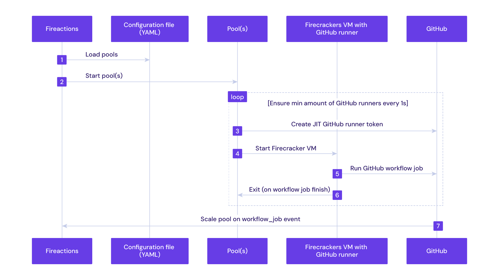

[](https://goreportcard.com/report/github.com/hostinger/fireactions)


// nested
   // span style="font-family:Times
 This Is Times Font And<i>this is in italics</i>.</font>

Fireactions is an orchestrator for GitHub runners. BYOM (Bring Your Own Metal) and run self-hosted GitHub runners in ephemeral, fast and secure [Firecracker](https://firecracker-microvm.github.io/) based virtual machines.

> [!IMPORTANT]
> There's been multiple improvements with a lot of breaking changes. The current stable version is **v2.0.0**. Please use this version for production environments.
###
    { "0                     ::ic<i1"

    { "∆Y ={∆L,•(√p-√vp("i1")::i1≤ic<iu'

    { "∆L√(p(iu)-√p(i1)      ::ic>icu"

     {                       ::ic<i1u"

<!--https://excalidraw.com/#json=GrJMj6LLYt39mgC0me7Di,C65TV9FhicnxNKgPeRhi3A
sequenceDiagram
    autonumber
    participant Fireactions
    participant Configuration file (YAML)
    participant Pool(s)
    participant Firecracker VM with GitHub runner participant GitHub
   Fireactions->>Configuration file (YAML): Load pools
    Fireactions->>Pool(s): Start pool(s)
    loop Ensure min amount of GitHub runners every 1s
        Pool(s)->>GitHub: Create JIT GitHub runner token
        Pool(s)->>Firecracker VM with GitHub runner: Start Firecracker VM
        Firecracker VM with GitHub runner->>GitHub: Run GitHub workflow job
        Firecracker VM with GitHub runner->>Pool(s): Exit (on workflow job finish)
    end GitHub->>Fireactions: Scale pool on workflow_job event-->

Several key features:

 # **Scalable**

 Pool based scaling approach. Fireactions always ensures the minimum amount of GitHub runners in the pool.

# **Ephemeral**

  Each virtual machine is created from scratch and destroyed after the job is finished, no state is preserved between jobs, just like with GitHub hosted runners.

# **Customizable**

  Define job labels and customize virtual machine resources to fit Your needs.

## Quickstart

```bash
$ fireactions --help
BYOM (Bring Your Own Metal) and run self-hosted GitHub runners in ephemeral, fast and secure Firecracker based virtual machines.

Usage:
  fireactions [command]

Main application commands:
  server      Starts the server
  agent       Starts the agent and GitHub Actions runner inside the VM

Pool management commands:
  pools       Manage pools

Machine management commands:
  ps          List all running machines across all pools
  login       SSH into a running VM as root user
  logs        Stream logs from the fireactions-agent service inside a machine

Image management commands:
  image       Manage images

Additional Commands:
  version     Show version information
  help        Help about any command
  completion  Generate the autocompletion script for the specified shell

Flags:
  -h, --help      help for fireactions
  -v, --version   version for fireactions

Use "fireactions [command] --help" for more information about a command.
```

See the [User Guide](https://fireactions.io/latest/) for installation and configuration instructions.
``
## [Contributing]

• Port 20-FTP(file transfer protocol).

• Port 22-SSH&SFTP.

• Port 25-SMTP(OUTGOING EMAIL).

• Port 465-SMTP-OVER-SSL.

• Port 143-IMAP(Incoming Email).

• Port 993-IMAP-OVER-SSL.

• Layer layer -PPP-DSL-wi-fi-etc.

• Internal Layer -IPV4 -IPV6.

• Transport Layer -TCP,UDP,UDPS,etc.

• Application Layer -HTTP,IMAP,FTP,etc

See [CONTRIBUTING.md](CONTRIBUTING.md) for more information on how to contribute to Fireactions.

••• License:
<!DOCTYPE html PUBLIC /W3C//DTD XHTML 1.0 Strict//EN" "http://www.w3.org/TR/xhtml1/DTD/xhtml1-strict.dtd">
<html>
<head>
<title>Embedded Sequence Viewer with parameters</title>
<script type="text/javascript" src="https://www.ncbi.nlm.nih.gov/projects/sviewer/js/sviewer.js">
</script>
</head>
<body>
<div id="sviewer_NCBI" class="SeqViewerApp" data-autoload>
<a href="?embedded=true&report=graph&tracks=[key:feature_track,name:Repeat region,display_name:Repeat region,id:STD3463812800,subkey:repeat_region,annots:Unnamed,shown:true,order:0][key:sequence_track,name:T1404743,display_name:Sequence,id:T1404743,dbname:GenBank,annots:NA,ShowLabel:false,ColorGaps:false,shown:true,order:1][key:gene_model_track,name:Genes,display_name:Genes,id:STD3194982005,annots:Unnamed,Options:MergeAll,CDSProductFeats:false,NtRuler:true,AaRuler:true,HighlightMode:2,ShowLabel:true,shown:true,order:2]&assm_context=GCF_000005845.1&v=1:4639675&c=969696&select=null&slim=0&appname=no_appname"></a>
</div>
</body>
</html>https://www.ncbi.nlm.nih.gov/nuccore/49175990?report=graph&tracks=[key:feature_track,name:Repeat region,display_name:Repeat region,id:STD3463812800,subkey:repeat_region,annots:Unnamed,shown:true,order:0][key:sequence_track,name:T1404743,display_name:Sequence,id:T1404743,dbname:GenBank,annots:NA,ShowLabel:false,ColorGaps:false,shown:true,order:1][key:gene_model_track,name:Genes,display_name:Genes,id:STD3194982005,annots:Unnamed,Options:MergeAll,CDSProductFeats:false,NtRuler:true,AaRuler:true,HighlightMode:2,ShowLabel:true,shown:true,order:2]&assm_context=GCF_000005845.1&v=1:4639675&c=969696&select=null&slim=0
<?xml version="1.0" encoding="us-ascii"?>
<feed
xmlns="http://www.w3.org/2005/Atom"
xmlns:thr="http://purl.org/syndication/thread/1.0"><title>All of lore.kernel.org</title>
<link
rel="alternate"
type="text/html"
href="https://lore.kernel.org/all/"/>
<link
rel="self"
href="https://lore.kernel.org/all/new.atom"/><id>mailto:unknown@example.com</id>
<updated>2026-09-30T06:20:48Z</updated>
<entry>
<author>
<name>Jiayuan Chen</name>
<email>jiayuan.chen@linux.dev</email>
</author>
<title>Re: [PATCH net 1/2] ipv4: fix IP ID reuse in ip_select_ident_segs()
</title><updated>2026-09-30T06:20:48Z</updated>
<link
href="https://lore.kernel.org/all/09dbb29d-8ab4-4228-9151-dd640449f05e@linux.dev/"/>
<id>urn:uuid:dbc60c8d-de39-804b-804c-d70b15bcdaa3</id><thr:in-reply-to
ref="urn:uuid:1ea8dbc8-366c-dfc5-d4b8-4939745989ec"
href="https://lore.kernel.org/all/20260929131247.401104-2-edumazet@kernel.org/"/><content
type="xhtml">
<div
xmlns="http://www.w3.org/1999/xhtml">
<pre
style="white-space:pre-wrap">
On 9/29/26 9:12 PM, Eric Dumazet wrote:
<span
class="q">&gt; ip_select_ident_segs() must put the first of the @segs reserved IP IDs
&gt; in iph-&gt;id, as GSO assigns id, id + 1, ..., id + segs - 1 to segments.
&gt;
&gt; Commit f866fbc842de (&#34;ipv4: fix data-races around inet-&gt;inet_id&#34;)
&gt; used atomic_add_return() for non-TCP sockets, which returns the first
&gt; ID of the next packet instead. Consecutive GSO packets can then reuse
&gt; IP IDs.
&gt;
&gt; SCTP GSO is affected. Other callers use segs == 1, and only see
&gt; a harmless off-by-one (UDP GSO has a separate, older issue, see
&gt; following patch in this series).
&gt;
&gt; Use atomic_fetch_add() instead, like the TCP path.
&gt;
&gt; Fixes: f866fbc842de (&#34;ipv4: fix data-races around inet-&gt;inet_id&#34;)
&gt; Signed-off-by: Eric Dumazet &lt;edumazet@kernel.org&gt;
</span>
Reviewed-by: Jiayuan Chen &lt;jiayuan.chen@linux.dev&gt;
<span
class="q">&gt; ---
&gt;   include/net/ip.h | 2 +-
&gt;   1 file changed, 1 insertion(+), 1 deletion(-)
&gt;
&gt; diff --git a/include/net/ip.h b/include/net/ip.h
&gt; index 6f602df72ee621ee4ee45e70beef0a1b5145367f..6a3e8271a73b3669e97c4b389e916dbcbfa9f6ae 100644
&gt; --- a/include/net/ip.h
&gt; +++ b/include/net/ip.h
&gt; @@ -598,7 +598,7 @@ static inline void ip_select_ident_segs(struct net *net, struct sk_buff *skb,
&gt;   			val = atomic_read(&#38;inet_sk(sk)-&gt;inet_id);
&gt;   			atomic_set(&#38;inet_sk(sk)-&gt;inet_id, val + segs);
&gt;   		} else {
&gt; -			val = atomic_add_return(segs, &#38;inet_sk(sk)-&gt;inet_id);
&gt; +			val = atomic_fetch_add(segs, &#38;inet_sk(sk)-&gt;inet_id);
&gt;   		}
&gt;   		iph-&gt;id = htons(val);
&gt;   		return;
</span>
</pre>
</div>
</content>
</entry>
<entry>
<author>
<name>ddprobe</name>
<email>ddprobe@kernel.org</email>
</author>
<title>RTT-PROBE: lore-subspace-rtt</title>
<updated>2026-09-30T06:20:34Z</updated>
<link
href="https://lore.kernel.org/all/179074923368.15470.1200655927766424342.rtt-probe@aws-us-west-2-korg-lkml-1.web.codeaurora.org/"/>
<id>urn:uuid:e1dbbea7-d8d8-39fa-ac59-dcb515e9b010</id>
<content
type="xhtml">
<div
xmlns="http://www.w3.org/1999/xhtml"><pre
style="white-space:pre-wrap">rtt-probe:lore-subspace-rtt:1790749233
</pre>
</div>
</content>
</entry>
<entry>
<author>
<name>sashiko-bot</name>
<email>sashiko-bot@kernel.org</email>
</author>
<title>Re: [PATCH v9 14/15] ARM: dts: aspeed: anacapa: Update EDSFF power status signals
</title>
<updated>2026-09-30T06:20:28Z</updated>
<link
href="https://lore.kernel.org/all/20260930062027.D26AF1F000FF@smtp.kernel.org/"/><id>urn:uuid:03bb7a18-28c3-ee4d-e61e-d6e778446c63</id>
<thr:in-reply-to
ref="urn:uuid:f6d45e37-7e95-59ef-c8be-3002f3d9a807"
href="https://lore.kernel.org/all/20260930-anacapa-devlop-phase-devicetree-v9-14-f08aa0d7182d@gmail.com/"/>
<content
type="xhtml">
<div
xmlns="http://www.w3.org/1999/xhtml"><pre
style="white-space:pre-wrap">Thank you for your contribution! Sashiko AI review found 1 potential issue(s) to consider:
- [Medium] dts: aspeed: anacapa: missing SGPIO line rename for EVT1
--

commit cde2dbf50bae37ad4a486fdf1cafec415093ffef
Author: Rex Fu &lt;rex.fu.amd@gmail.com&gt;

ARM: dts: aspeed: anacapa: Update EDSFF power status signals

The CPLD definition for the EDSFF power status signals has changed
from PG to FLT. Update the corresponding SGPIO line names to match
the CPLD definition.

<span
class="q">&gt; diff --git a/arch/arm/boot/dts/aspeed/aspeed-bmc-facebook-anacapa-evt2.dtsi b/arch/arm/boot/dts/aspeed/aspeed-bmc-facebook-anacapa-evt2.dtsi
&gt; index 5c0d874fa24af..766aa26b6cea5 100644
&gt; --- a/arch/arm/boot/dts/aspeed/aspeed-bmc-facebook-anacapa-evt2.dtsi
&gt; +++ b/arch/arm/boot/dts/aspeed/aspeed-bmc-facebook-anacapa-evt2.dtsi
&gt; @@ -370,7 +370,7 @@ &#38;sgpiom0 {
&gt;  	&#34;L_PRSNT_EDSFF1_N&#34;, &#34;&#34;,
&gt;  	&#34;R_PRSNT_EDSFF2_N&#34;, &#34;&#34;,
&gt;  	&#34;R_PRSNT_EDSFF3_N&#34;, &#34;&#34;,
&gt; -	&#34;HPM_EDSFF_PG&#34;, &#34;&#34;,
&gt; +	&#34;EDSFF_BOOT_FLT&#34;, &#34;&#34;,
</span>
[Severity: Medium]
Are we intentionally leaving the old &#34;PG&#34; naming scheme in EVT1 hardware?

If userspace daemons depend on the updated &#34;FLT&#34; SGPIO line names for EDSFF
power status monitoring, they might fail to find these lines on EVT1 hardware
and break power management or monitoring logic.

For example, arch/arm/boot/dts/aspeed/aspeed-bmc-facebook-anacapa-evt1.dtsi
still contains this legacy name under sgpiom0:

    &#34;HPM_EDSFF_PG&#34;, &#34;&#34;,

Should this update be applied to the EVT1 devicetree as well?

<span
class="q">&gt;  	&#34;&#34;, &#34;&#34;,
&gt;  	&#34;&#34;, &#34;FM_BMC_READY_PLD&#34;,
</span>
[ ... ]

<span
class="q">&gt; @@ -416,10 +416,10 @@ &#38;sgpiom0 {
&gt;  	&#34;PDB_ALERT_R_N&#34;, &#34;&#34;,
&gt;  
&gt;  	/* L0-L7 line 176-191 */
&gt; -	&#34;L_EDSFF0_PG&#34;, &#34;&#34;,
&gt; -	&#34;L_EDSFF1_PG&#34;, &#34;&#34;,
&gt; -	&#34;R_EDSFF2_PG&#34;, &#34;&#34;,
&gt; -	&#34;R_EDSFF3_PG&#34;, &#34;&#34;,
&gt; +	&#34;L_EDSFF0_FLT&#34;, &#34;&#34;,
&gt; +	&#34;L_EDSFF1_FLT&#34;, &#34;&#34;,
&gt; +	&#34;R_EDSFF2_FLT&#34;, &#34;&#34;,
&gt; +	&#34;R_EDSFF3_FLT&#34;, &#34;&#34;,
</span>
[Severity: Medium]
Similarly, arch/arm/boot/dts/aspeed/aspeed-bmc-facebook-anacapa-evt1.dtsi
still contains these &#34;PG&#34; lines under sgpiom0:

    &#34;L_EDSFF0_PG&#34;, &#34;&#34;, &#34;L_EDSFF1_PG&#34;, &#34;&#34;,
    &#34;R_EDSFF2_PG&#34;, &#34;&#34;, &#34;R_EDSFF3_PG&#34;, &#34;&#34;,

Is EVT1 deprecated, or did it miss this SGPIO line rename?

<span
class="q">&gt;  	&#34;HPM_CPLD_HEART_BIT&#34;, &#34;&#34;,
&gt;  	&#34;RBB_CPLD_HEART_BIT&#34;, &#34;&#34;,
</span>
-- 
Sashiko AI review &#183; <a
href="https://sashiko.dev/#/patchset/20260930-anacapa-devlop-phase-devicetree-v9-0-f08aa0d7182d@gmail.com?part=14">https://sashiko.dev/#/patchset/20260930-anacapa-devlop-phase-devicetree-v9-0-f08aa0d7182d@gmail.com?part=14</a>
</pre>
</div>
</content>
</entry>
<entry>
<author>
<name>Francesco Valla</name>
<email>francesco@valla.it</email>
</author>
<title>Re: [PATCH 1/2] dt-bindings: spi: add bindings for spi-virtio</title>
<updated>2026-09-30T06:19:22Z</updated>
<link
href="https://lore.kernel.org/all/arypmHeudsJm4RIN@bywater/"/>
<id>urn:uuid:515203bb-caf3-b872-3f6b-6c10e97545a5</id><thr:in-reply-to
ref="urn:uuid:6666d342-a9d3-185d-5bb8-60be4afbb9df"
href="https://lore.kernel.org/all/20260929165015.E5DDF1F000FF@smtp.kernel.org/"/><content
type="xhtml">
<div
xmlns="http://www.w3.org/1999/xhtml"><pre
style="white-space:pre-wrap">On Tue, Sep 29, 2026 at 04:50:14PM +0000, sashiko-bot@kernel.org wrote:
<span
class="q">&gt; Thank you for your contribution! Sashiko AI review found 1 potential issue(s) to consider:
&gt; - [Low] dt-bindings: spi-virtio: undocumented compatible in example
&gt; --
&gt; 
&gt; commit eb6ae8a9a8b3aa403347f70589897a8c7d297186
&gt; Author: Francesco Valla &lt;francesco@valla.it&gt;
&gt; 
&gt; dt-bindings: spi: add bindings for spi-virtio
&gt; 
&gt; This commit adds device tree bindings for spi-virtio based on virtio-device.
&gt; It defines the properties and node dependencies for the virtio SPI controller.
&gt; 
&gt; &gt; diff --git a/Documentation/devicetree/bindings/spi/spi-virtio.yaml b/Documentation/devicetree/bindings/spi/spi-virtio.yaml
&gt; &gt; new file mode 100644
&gt; &gt; index 0000000000000..5b8639dd2e1f1
&gt; &gt; --- /dev/null
&gt; &gt; +++ b/Documentation/devicetree/bindings/spi/spi-virtio.yaml
&gt; 
&gt; [ ... ]
&gt; 
&gt; &gt; +examples:
&gt; &gt; +  - |
&gt; &gt; +    virtio@3000 {
&gt; &gt; +        compatible = &#34;virtio,mmio&#34;;
&gt; &gt; +        reg = &lt;0x3000 0x100&gt;;
&gt; &gt; +        interrupts = &lt;41&gt;;
&gt; &gt; +
&gt; &gt; +        spi {
&gt; &gt; +            compatible = &#34;virtio,device2d&#34;;
&gt; &gt; +
&gt; &gt; +            #address-cells = &lt;1&gt;;
&gt; &gt; +            #size-cells = &lt;0&gt;;
&gt; &gt; +
&gt; &gt; +            sram@0 {
&gt; &gt; +                compatible = &#34;microchip,mchp23k256&#34;;
&gt; 
&gt; [Severity: Low]
&gt; Is this compatible string documented in any existing binding schema?
&gt;
</span>
Yes - the compatible fot the Microchip MCHP23K256 is documented in:

  Documentation/devicetree/bindings/mtd/microchip,mchp23k256.yaml

<span
class="q">&gt; The dt_binding_check tool strictly validates all compatible strings against
&gt; known schemas, so an undocumented compatible string in an example will emit a
&gt; schema validation warning.
&gt; 
&gt; When running make dt_binding_check on the new spi-virtio.yaml file, it
&gt; parses the example and attempts to match microchip,mchp23k256 against
&gt; registered bindings, which fails if none exist.
&gt; 
&gt; &gt; +                reg = &lt;0&gt;;
&gt; &gt; +                spi-max-frequency = &lt;20000000&gt;;
&gt; &gt; +            };
&gt; &gt; +        };
&gt; &gt; +    };
&gt; &gt; +
&gt; &gt; +...
&gt; 
&gt; -- 
&gt; Sashiko AI review &#183; <a
href="https://sashiko.dev/#/patchset/20260929-spi-virtio-bindings-v1-0-6a0eef3213b3@valla.it?part=1">https://sashiko.dev/#/patchset/20260929-spi-virtio-bindings-v1-0-6a0eef3213b3@valla.it?part=1
</a>
</span>
</pre>
</div>
</content>
</entry>
<entry>
<author>
<name>Chongchong Ding</name>
<email>chongchong.ding@amlogic.com</email></author><title>[PATCH] ARM: hibernate: flush TLB after switching to idmap</title>
<updated>2026-09-30T06:19:14Z</updated>
<link
href="https://lore.kernel.org/all/20260930-hibernate-tlb-flush-v1-1-a0143c144c19@amlogic.com/"/>
<id>urn:uuid:c650c130-6749-0001-aa44-82c7396fe4c9</id>
<content
type="xhtml">
<div
xmlns="http://www.w3.org/1999/xhtml">
<pre
style="white-space:pre-wrap">On 32-bit ARM, hibernate switches to the identity mapping to copy pages.
The idmap keeps an early RW snapshot of kernel mappings, so
STRICT_KERNEL_RWX text/rodata can be written during restore.

cpu_switch_mm() does not drop the global TLB entries from swapper.
copy_page() can therefore still hit the old RO translations and fail to
restore kernel RO sections.

Flush the local BTB and TLB after installing the idmap, matching
setup_mm_for_reboot() and the cpu_suspend() resume path.

Signed-off-by: Chongchong Ding &lt;chongchong.ding@amlogic.com&gt;
---
arch/arm/kernel/hibernate.c is only compiled when CONFIG_HIBERNATION is
enabled, and none of the 32-bit ARM defconfigs enable it, so the ARM
hibernation code has never been covered by the regular build tests.  This
bug was found while enabling the option for build coverage.
---
 arch/arm/kernel/hibernate.c | 12 ++++++++++++
 1 file <a href="https://lore.kernel.org/all/20260930-hibernate-tlb-flush-v1-1-a0143c144c19@amlogic.com/#related">changed</a>, 12 insertions(+)

<span
class="head">diff --git a/arch/arm/kernel/hibernate.c b/arch/arm/kernel/hibernate.c
index 231a76af09a0..1c7c1cb6dade 100644
--- a/arch/arm/kernel/hibernate.c
+++ b/arch/arm/kernel/hibernate.c
</span><span
class="hunk">@@ -21,6 +21,7 @@
</span> #include &lt;asm/suspend.h&gt;
 #include &lt;asm/page.h&gt;
 #include &lt;asm/sections.h&gt;
<span
class="add">+#include &lt;asm/tlbflush.h&gt;
</span> #include &lt;asm/uaccess.h&gt;
 #include &#34;reboot.h&#34;
 
<span
class="hunk">@@ -93,6 +94,17 @@ static void notrace arch_restore_image(void *unused)
</span> 	if (IS_ENABLED(CONFIG_CPU_TTBR0_PAN))
 		uaccess_save_and_enable();
 	cpu_switch_mm(idmap_pgd, &#38;init_mm);
<span
class="add">+	local_flush_bp_all();
+
+#ifdef CONFIG_CPU_HAS_ASID
+	/*
+	 * The identity mapping has no clean ASID and may clash with entries
+	 * left behind by the previous page tables.  Without this flush,
+	 * copy_page() can translate through the stale read-only kernel
+	 * mappings instead of the writable aliases in the idmap.
+	 */
+	local_flush_tlb_all();
+#endif
</span> 	for (pbe = restore_pblist; pbe; pbe = pbe-&gt;next)
 		copy_page(pbe-&gt;orig_address, pbe-&gt;address);
 

<span
class="del">---
</span>base-commit: 551c722f40809618230001baccf219193e22fc5a
change-id: 20260928-hibernate-tlb-flush-f2c1c5315625

Best regards,
<span
class="del">--  
</span>Chongchong Ding &lt;chongchong.ding@amlogic.com&gt;

</pre>
</div>
</content>
</entry>
<entry>
<author>
<name>Jan Beulich</name>
<email>jbeulich@suse.com</email>
</author>
<title>Re: [PATCH v3 1/6] docs/riscv: sync required ISA extensions with required_extensions[]
</title><updated>2026-09-30T06:19:00Z</updated>
<link
href="https://lore.kernel.org/all/9f74c9c1-72c0-4bad-8a64-8b694b9c4386@suse.com"/>
<id>urn:uuid:4f2630a5-d7c2-e853-a7c2-8756b7a21887</id>
<thr:in-reply-to
ref="urn:uuid:5d451a71-7ba6-13b4-c164-33f089464c23"
href="https://lore.kernel.org/all/1790699584.8631fc262581453bbf619ec5b2062170.1a0ee033d8d000b504@vates.tech/"/>
<content
type="xhtml"><div
xmlns="http://www.w3.org/1999/xhtml"><pre
style="white-space:pre-wrap">On 29.09.2026 18:32, Baptiste Le Duc wrote:
<span
class="q">&gt; From: Oleksii Kurochko &lt;oleksii.kurochko@gmail.com&gt;
&gt; 
&gt; booting.txt listed only H, Zbb, Zihintpause and Svpbmt as required, while
&gt; required_extensions[] in cpufeature.c also checks for I, M, A, Zicsr,
&gt; Zifencei and, with CONFIG_RISCV_ISA_C=y, C. As the panic message printed
&gt; for a missing extension points to booting.txt, document the missing ones.
&gt; 
&gt; Also add a section pointing to riscv_isa_ext[] for the optional extensions
&gt; Xen recognises, and a comment above required_extensions[] to keep it in
&gt; sync with the document.
&gt; 
&gt; No functional change.
&gt; 
&gt; Suggested-by: Baptiste Le Duc &lt;baptiste.le-duc@vates.tech&gt;
&gt; Signed-off-by: Oleksii Kurochko &lt;oleksii.kurochko@gmail.com&gt;
&gt; Signed-off-by: Baptiste Le Duc &lt;baptiste.le-duc@vates.tech&gt;
</span>
Acked-by: Jan Beulich &lt;jbeulich@suse.com&gt;


</pre>
</div>
</content>
</entry>
<entry>
<author>
<name>Jiayuan Chen</name>
<email>jiayuan.chen@linux.dev</email>
</author>
<title>Re: [PATCH net 2/2] ipv4: reserve one IP ID per segment for UDP GSO packets</title>
<updated>2026-09-30T06:18:56Z</updated>
<link
href="https://lore.kernel.org/all/a988ac49-d701-4588-9e66-85bf3d6d0e12@linux.dev"/>
<id>urn:uuid:a6e2ff8f-9fba-e418-4e97-f180ce985048</id>
<thr:in-reply-to
ref="urn:uuid:3f249043-6f7f-7843-7e19-d1fe52517308"
href="https://lore.kernel.org/all/20260929131247.401104-3-edumazet@kernel.org/"/><content
type="xhtml">
<div
xmlns="http://www.w3.org/1999/xhtml">
<pre
style="white-space:pre-wrap">
On 9/29/26 9:12 PM, Eric Dumazet wrote:
<span
class="q">&gt; __ip_make_skb() reserves a single IP ID for UDP GSO packets, but GSO
&gt; assigns one IP ID per segment. Following packets then reuse these IDs,
&gt; either from inet-&gt;inet_id or from the shared generator.
&gt;
&gt; Unless IP_PMTUDISC_DO/PROBE is used, DF is not set on UDP GSO packets,
&gt; so segments can be fragmented on the path and IP ID reuse can lead to
&gt; incorrect reassembly.
&gt;
&gt; Reserve one IP ID per segment, using the same test as udp_send_skb().
&gt;
&gt; Fixes: bec1f6f69736 (&#34;udp: generate gso with UDP_SEGMENT&#34;)
&gt; Signed-off-by: Eric Dumazet &lt;edumazet@kernel.org&gt;
</span>

Reviewed-by: Jiayuan Chen &lt;jiayuan.chen@linux.dev&gt;


<span
class="q">&gt; ---
&gt;   net/ipv4/ip_output.c | 15 ++++++++++++++-
&gt;   1 file changed, 14 insertions(+), 1 deletion(-)
&gt;
&gt; diff --git a/net/ipv4/ip_output.c b/net/ipv4/ip_output.c
&gt; index a24cc8ee11d3ea3069bcc0d4d12e6867c2c475f7..b1cf0c6bfc79c8d234cc81ff32332116c1ee3401 100644
&gt; --- a/net/ipv4/ip_output.c
&gt; +++ b/net/ipv4/ip_output.c
&gt; @@ -1410,6 +1410,7 @@ struct sk_buff *__ip_make_skb(struct sock *sk,
&gt;   	struct iphdr *iph;
&gt;   	u8 pmtudisc, ttl;
&gt;   	__be16 df = 0;
&gt; +	int segs;
&gt;   
&gt;   	skb = __skb_dequeue(queue);
&gt;   	if (!skb)
&gt; @@ -1464,7 +1465,19 @@ struct sk_buff *__ip_make_skb(struct sock *sk,
&gt;   	iph-&gt;ttl = ttl;
&gt;   	iph-&gt;protocol = sk-&gt;sk_protocol;
&gt;   	ip_copy_addrs(iph, fl4);
&gt; -	ip_select_ident(net, skb, sk);
&gt; +
&gt; +	/* UDP GSO packets are segmented later (see udp_send_skb()):
&gt; +	 * reserve one IP ID per segment.
&gt; +	 */
&gt; +	segs = 1;
&gt; +	if (cork-&gt;gso_size) {
&gt; +		int datalen = skb-&gt;len - skb_transport_offset(skb) -
&gt; +			      sizeof(struct udphdr);
&gt; +
&gt; +		if (datalen &gt; cork-&gt;gso_size)
&gt; +			segs = DIV_ROUND_UP(datalen, cork-&gt;gso_size);
&gt; +	}
&gt; +	ip_select_ident_segs(net, skb, sk, segs);
&gt;   
&gt;   	if (opt) {
&gt;   		iph-&gt;ihl += opt-&gt;optlen &gt;&gt; 2;
</span></pre></div></content></entry><entry><author><name>Yu-Chun Lin [&#26519;&#31056;&#21531;]</name><email>eleanor.lin@realtek.com</email></author><title>RE: [PATCH v14 09/11] clk: realtek: Add RTD1625-CRT clock controller driver</title><updated>2026-09-30T06:18:36Z</updated><link
href="https://lore.kernel.org/all/0288fc6490dd4bd4abb0773ad4b5e8d2@realtek.com/"/><id>urn:uuid:b562d992-87c2-49d5-21f5-6ba6a0844442</id><thr:in-reply-to
ref="urn:uuid:6cf0eec4-c7a6-a3f4-9bdf-d50b30470168"
href="https://lore.kernel.org/all/1jjyo98zh4.fsf@starbuckisacylon.baylibre.com/"/><content
type="xhtml"><div
xmlns="http://www.w3.org/1999/xhtml"><pre
style="white-space:pre-wrap"><span
class="q">&gt; &gt; Hi Jerome,
&gt; &gt;
&gt; &gt;&gt; &gt; +
&gt; &gt;&gt; &gt; +static const char * const clk_gpu_parents[] = {&#34;pll_gpu&#34;,
&gt; &gt;&gt; &gt; +&#34;clk_sys&#34;}; static RTK_CLK_REGMAP_MUX(clk_gpu, clk_gpu_parents,
&gt; &gt;&gt; CLK_SET_RATE_PARENT | CLK_SET_RATE_NO_REPARENT,
&gt; &gt;&gt; &gt; +                       0x28, 12, 0x1); static const char * const
&gt; &gt;&gt; &gt; +clk_ve_parents[] = {&#34;pll_vo&#34;, &#34;clk_sysh&#34;, &#34;pll_ve1&#34;, &#34;pll_ve2&#34;};
&gt; &gt;&gt; &gt; +static RTK_CLK_REGMAP_MUX(clk_ve1, clk_ve_parents,
&gt; &gt;&gt; CLK_SET_RATE_PARENT | CLK_SET_RATE_NO_REPARENT,
&gt; &gt;&gt; &gt; +                       0x4c, 0, 0x3); static
&gt; &gt;&gt; &gt; +RTK_CLK_REGMAP_MUX(clk_ve2, clk_ve_parents,
&gt; CLK_SET_RATE_PARENT |
&gt; &gt;&gt; CLK_SET_RATE_NO_REPARENT,
&gt; &gt;&gt; &gt; +                       0x4c, 3, 0x3); static
&gt; &gt;&gt; &gt; +RTK_CLK_REGMAP_MUX(clk_ve4, clk_ve_parents,
&gt; CLK_SET_RATE_PARENT |
&gt; &gt;&gt; CLK_SET_RATE_NO_REPARENT,
&gt; &gt;&gt; &gt; +                       0x4c, 6, 0x3); static
&gt; &gt;&gt; &gt; +RTK_CLK_REGMAP_GATE_NO_PARENT(clk_en_misc, CLK_IS_CRITICAL,
&gt; 0x50,
&gt; &gt;&gt; 0,
&gt; &gt;&gt; &gt; +1); clk_en_pcie0, 0, 0x50, 2,
&gt; &gt;&gt; &gt; +1); clk_en_gspi, 0, 0x50, 6, 1);
&gt; &gt;&gt; &gt; +clk_en_iso_misc, 0, 0x50, 10,
&gt; &gt;&gt; &gt; +1); clk_en_sds, 0, 0x50, 12, 1);
&gt; &gt;&gt; &gt; +clk_en_hdmi, 0, 0x50, 14, 1);
&gt; &gt;&gt;
&gt; &gt;&gt; This is a lot of clock with no parents which is a bit suspicious
&gt; &gt;&gt; especially for gates.
&gt; &gt;&gt; What is really feeding those ?
&gt; &gt;&gt;
&gt; &gt;
&gt; &gt; In v15, we will do our best to reduce the number of gate clocks without a
&gt; parent.
&gt; &gt;
&gt; &gt; However, after discussing with our colleague, we confirmed that for
&gt; &gt; some of these NO_PARENT gate clocks, their actual upstream clocks
&gt; &gt; (like PLLs and
&gt; &gt; Muxes) are located in separate, independent hardware subsy

See [LICENSE](LICENSE)
